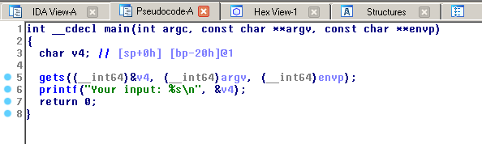
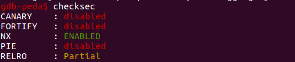
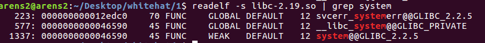
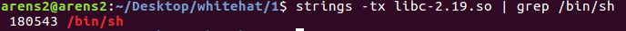
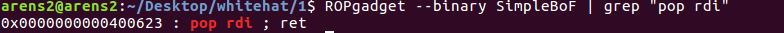
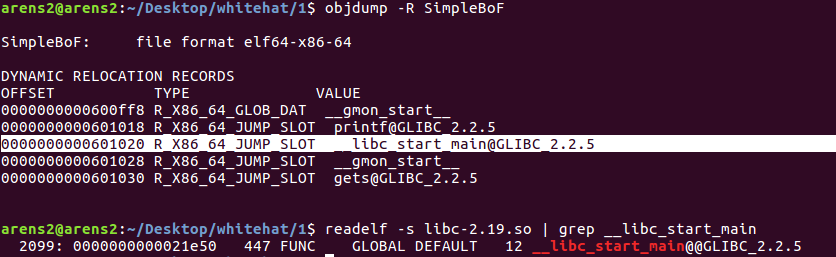
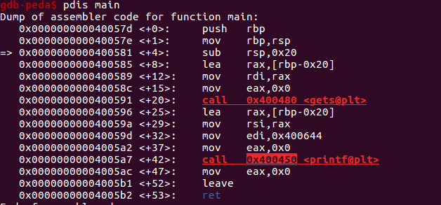

# Problem

```sh
Download file here:
file binary: http://material.wargame.whitehat.vn/challenges/1/Pwn001_71228e6714b5346bfff4ffa5003bc8f7.zip
libc: https://drive.google.com/file/d/1RpQZ28ylzCJPCEK0wKcv1l-LHGfpHKgK/view?usp=sharing

You can find flag here : /home/simplebof/flag
Submit WhiteHat{sha1(flag)}
nc 103.237.99.35 25031
```

# Solution
- Vì đây là bài write-up đầu tiên của mình nên mình xin phép viết hơi dài dòng 1 tí về từng bước làm để các bạn tiện theo dõi, mấy bài sau chắc không có đâu hehe ^^

- Đầu tiên, sau khi đọc xong phần mô tả của BTC, ta lần lượt tải hết các file về và thu được 2 file: [SimpleBoF](SimpleBoF) and [libc-2.19.so](libc-2.19.so).

- Thử kết nối đến server `nc 103.237.99.35 25031` xem thử mình có gì. Sau vài lần kết nối thì ta biết chương trình này khá đơn giản: chương trình nhận chuỗi mà chúng ta nhập vào và in lại chuỗi đấy ra màn hình và cũng kết thúc luôn chương trình.

- Bằng việc kiểm tra với lệnh `file` ta biết được 2 file này đều là file ELF 64bit. Thế thì mở `IDA 64bit` để xem chương trình này làm gì thôi (thật ra có nhiều tools khác giúp chúng ta dịch mấy cái file thực thi này ra mã assembly như gdb, objdump, ... nhưng IDA nó có thêm tính năng dịch sang Pseudocode ~ code C nên sẽ nhanh hiểu chương trình hơn). Sau khi mở hàm main ở dạng Pseudocode thì ta thấy hàm này quá ngắn và đơn giản : )) 



- Chương trình sử dụng hàm `gets` để lưu chuỗi mà chúng ta nhập vào biến v4. Thấy `gets` là biết ngay đây là 1 trong những nguyên nhân điển hình dẫn đến lỗi `Buffer overflow`, với lỗi này thì ta làm được khá là nhiều thứ như thay đổi giá trị của các biến đứng sau, thay đổi luồng thực thi của chương trình, ... Nhưng khoan đã phải kiểm tra cờ  `Canary` có Disable không đã, nếu nó mà Enable thì chúng ta bị hạn chế sức mạnh khá là nhiều đấy ^^, còn nếu nó mà Disable thật thì đây đúng là 1 bài Buffer Overflow cổ điển luôn, haha. Cùng kiểm tra với lệnh `checksec` trong `gdb-peda` nào!



- Đúng là Disable thật. Đối với loại lỗi BoF này thông thường sẽ viết shellcode (để chúng ta có cái shell để thực thi lệnh trên server) bỏ vào những vùng nhớ vừa có quyền write vừa có quyền execute như stack hoặc bss chẳng hạn, rồi sau khi đặt shellcode vào những vùng nhớ đó thì mình sẽ phải ghi đè giá trị của thèn `return address` thành đia chỉ của shellcode của chúng ta để sau khi nó thực thi hàm main xong thì nó sẽ vào shellcode của chúng ta làm tiếp và khi đó chúng ta sẽ có nhiều thứ để làm đấy xD. Nhưng đối với bài này thì không đơn giản vậy, khi kiểm tra với `checksec` thì ta nhận thấy cờ `NX` Enable, điều này có nghĩa là những vùng nhớ có quyền write thì sẽ không có quyền execute, và nếu thế thì dù có viết được shellcode vào những vùng nhớ đó thì nó cũng không chạy được T.T 

- Đúng, thông thường là sẽ dùng shellcode nhưng đôi khi chúng ta cũng không cần chúng, chúng ta có thể dùng nhiều thứ khác như hàm exec() hoặc system() chẳng hạn (nếu như chúng có sẵn trong chương trình hoặc được nạp vào bộ nhớ khi thực thi thông qua file libc), cả 2 cái này điều có thể giúp chúng ta có được cái shell. Trong bài này đề có cho chúng ta 1 file `libc-2.19.so`, khi thấy file libc này là biết ngay chúng ta sẽ có thể sử dụng hàm system() để khai thác rồi, còn dùng và khai thác được hay không lại là chuyện khác >.<

- Nói sơ qua chút hiểu biết của mình về cái file libc này (size khá nặng đấy). File này nó chứa rất nhiều thứ (các hàm chuẩn, section header, ...)  của ngôn ngữ C nhưng lại không có hàm main. Mỗi khi chúng ta chạy 1 chương trình C chẳng hạn thì nó sẽ load file này vào bộ nhớ, và những hàm như printf, scanf thì được lấy từ file này. Để xem được các hàm mà file này có chúng ra có thể sử dụng lệnh `readelf -s libc-2.19.so` trong terminal. Trong bài này cái chúng ta quan tâm đến trong file libc này là hàm `system()` và chuỗi `/bin/sh\x00` làm tham số cho hàm `system()` vì nó có thể giúp ta có cái shell và sau đó vào server để kiếm `flag`. Tuy nhiên ở đây lại có 1 vấn đề, khi mình tìm địa chỉ của hàm `system()` và chuỗi `/bin/sh\x00` trong file libc: 




- Chúng ta có thể thấy hàm `system()` có địa chỉ 0x46590, chuỗi `/bin/sh` có địa chỉ 0x180543  nhưng đây chỉ là địa chỉ offset trong file này thôi, khi loaded vào bộ nhớ nó sẽ có 1 địa chỉ khác và chúng ta phải tìm được cái địa chỉ này thì mới có cơ hội gọi được hàm `system()` và tham số `/bin/sh` của nó.

- Thôi được rồi, dài dòng quá, bàn về hướng khai khác bài này đã. Nhìn vào cái hình có hàm `main` ở trên ta thấy vị trí của biến v4 trong stack cách vị trí được chỉ bởi thanh ghi `rbp` 0x20 byte, sau đó là đến 8 byte giá tri của địa chỉ được lưu trong `rbp`,sau `rbp` sẽ là `return address` của main để sau khi làm xong main thì nó sẽ làm 1 số hàm khác để kết thúc chương trình 1 cách bình thường (dĩ nhiên nếu chúng ta không đụng đến cái `return address` này). Vì thế, chúng ta sẽ viết 1 payload gồm 0x28 kí tự bất kì để lấp vùng nhớ của biến v4 và `rbp`, tiếp đến là 8 byte của hàm system, tiếp đến là 8 byte địa chỉ bất kì thật ra cái này là `return address` của hàm `system()` (sau khi làm hàm system xong sẽ vào làm hàm này nhưng chúng ta không cần lắm vì thực thi được `system` thì vào được server rồi), cuối cùng là 8 byte địa chỉ của chuỗi `/bin/sh\x00`. Nghe có vẻ có hướng rồi đấy, quất thôi ^^ Mới đầu mình cũng làm thế nhưng mình nhận ra nó có vấn đề: nếu chương trình này được biên dịch với 32bit thì làm như thế đúng rồi, nhưng cái này thì là 64bit. Sự khác nhau ở chỗ, khi gọi hàm: cái 32bit thì tham số của 1 hàm được lưu trên stack, còn cái 64bit thì tham số được lưu trên thanh ghi `rdi` (và các thanh ghi khác nếu có thêm tham số). Đấy, mình có `buffer overflow` và `canary` disable nên stack là thiên hạ của mình rồi, nhưng còn quản lí được thanh ghi hay không lại là chuyện khác.

- Haiz, nói nhảm đủ rồi, giờ vào vấn đề này. Chúng ta gặp 1 số rắc rối đối với bài này:
   + Quản lí được thanh ghi `rdi` để truyền được tham số cho hàm
   + Tìm được địa chỉ của 2 thèn `system` và `/bin/sh`

- Đối với `rdi` chúng ta sẽ sử dụng **ROPgadget** để tìm 1 vài câu lệnh assembly có sẵn trong chương trình và có thể giúp chúng ta khai thác.



- Đấy quá tuyệt, phải nói là may mà có đoạn code "mượt" như vậy ^^, `pop rdi` sẽ lấy giá trị trên đỉnh stack cho vào thanh ghi `rdi` mà stack là của chúng ta rồi nên giờ `rdi` cũng là của chúng ta luôn, lại còn có `ret` nữa thì sau khi `pop` xong chúng ta lại tiếp tục "vờn" với luồng thực thi của chương trình thôi xD 

- Đến vấn đề thứ 2 là địa chỉ của tụi kia. Thiệt chứ đây là cơn ác mộng được mang tên **Address** của mình bấy lâu nay. Nói chung đối với pwn thì hầu như mình phải luôn đi tìm address của 1 cái gì đó (shellcode, esp, 1 hàm nào đấy, ...) rồi mới có thể khai thác được. Với chương trình này, thoạt nhìn thì nhập, xuất, end --> thật đơn giản và ngắn gọn, nhưng lại là quá nhiều cho công cuộc khai thác của chúng ta rồi. Ở đây chúng ta có 2 hàm gets và printf (bộ đôi hoàn hảo khi đi cùng với `buffer overflow`).
Gets và printf nó đều là hàm, nhận tham số ở thèn `rdi`, có `ret` ở cuối hàm giống nhưng đoạn code `pop rdi; ret` mà chúng ta tìm được khi nãy, có địa chỉ cố định nữa chứ. Cách khai thác của `gets` cũng giống như `printf` mà bài này cần đến `printf` nên tạm quên `gets` đi vậy. Thèn `printf` in chuỗi được chỉ bởi thèn `rdi`, vậy nên ta có in ra bất kì giá trị nào trong bộ nhớ của chương trình (kết thúc khi gặp chuỗi end với "\x00") được chỉ bởi địa chỉ được lưu trong `rdi`. Vậy câu hỏi đặt ra là ta sẽ in cái gì bây giờ? Và tất nhiên câu trả lời sẽ là địa chỉ của 1 hàm nào đó trong có trong file libc để chúng ta suy ra được địa chỉ của `system()` và `/bin/sh`. Nhưng quan trọng hơn mấy cái địa chỉ của hàm trong file libc đấy nó được lưu ở đâu và câu trả lời chính là **GOT** (Global Offset Table).



- Trong GOT có hàm `__libc_start_main` của file libc được tải vào bộ nhớ của chúng ta, địa chỉ của hàm đấy được lưu ở địa chỉ 0x601020. Vậy nên nếu chúng ta dùng `printf` để in giá trị trong địa chỉ 0x601020 thì chúng ta sẽ suy ra được địa chỉ của hàm `__libc_start_main` khi được loaded vào trong bộ nhớ. Lúc này ta có địa chỉ khi loaded của `__libc_start_main` cùng với địa chỉ offset của nó mà chúng ta lại dễ dàng tìm được địa chỉ offset của `system` như lúc trên đã làm từ đó có thể dễ dàng suy ra được địa chỉ khi loaded của hàm `system()` và chuỗi `/bin/sh`. 

- Giờ xem như là có hết rồi đấy, tiến trình khai thác nào:
   + Khảo sát lần lượt tìm được offset của 2 hàm `__libc_start_main`, `system` cùng với chuỗi `/bin/sh`. Tìm được địa chỉ trong GOT lưu địa chỉ của hàm `__libc_start_main` sau khi đã được nạp.Tìm thêm được địa chỉ của hàm main (công dụng ở sau) và hàm printf.



   + Lượt đầu chúng ta sẽ in ra địa chỉ của hàm `__libc_start_main` bằng hàm `printf` và nhờ vào `ret` của `pop rdi; ret`, rồi nhờ vào `ret` của `printf` để quay trở lại `main` ^^. Sao không đến thẳng thèn `system()` mà phải về thèn `main` làm gì nhỉ ><, à lúc đấy mình đã có địa chỉ của `system` đâu, đúng là mình có in ra địa chỉ của `__libc_start_main` nhưng chưa tính toán địa chỉ của `system` vì thế phải quay về main.
   + Đến lượt này, đây là lượt nhập thứ 2 của chúng ta nhờ vào thèn `gets`, lúc này sau khi tính toán chúng ta đã có `system` và `/bin/sh`. Đến đây thì xem như xong rồi!

- Code khai thác mình để trong file exp.py.

Ps: Bài này là bài đầu tiên trong chuỗi challenge của whitehat về mảng pwn, theo cảm nhận của mình thì bài này khó hơn 6 bài sau, vì hiện tại mình mới làm được 7 bài : ))
 
