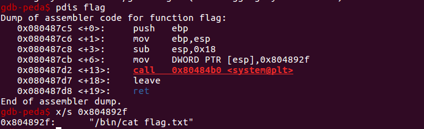
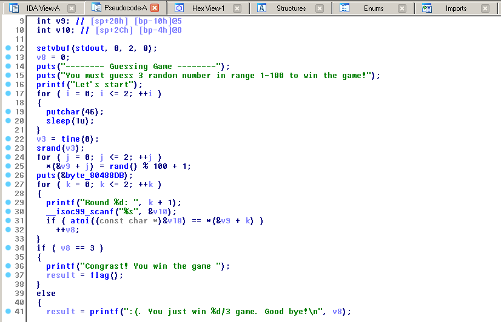

# Problem

```sh
Download file here:
http://material.wargame.whitehat.vn/challenges/2/Pwn001_c8cddbf033b280dcae556ebe77668bbd.zip
Submit WhiteHat{sha1(flag)}
Example: flag = Hello World
sha1("Hello World") = 0a4d55a8d778e5022fab701977c5d840bbc486d0
You must submit: WhiteHat{0a4d55a8d778e5022fab701977c5d840bbc486d0}
(all hash charactera in lowercase)
nc 103.237.99.35 25032
```

# Solution
- Với bài này thì ta có 1 file [guessing](guessing) (ELF 32bit), `canary` lại Disabled nên chúng ta có chút lợi thế rồi đấy.

- Sau 1 vài nốt nhạc kiểm tra sơ bộ về các hàm, ta thấy rằng tồn tại 1 hàm `flag` quá "lạnh lùng". Vậy nên chỉ cần vào được hàm này xem như là lấy được flag.



- Kiểm tra xem hàm `main` như thế nào để chúng ta có thể vào được hàm `flag` này:



- Bài này lúc đầu nó sinh ra 3 số ngẫu nhiên, sau đấy cho mình đoán 3 lần, nếu đúng hết cả 3 sẽ vào được hàm `flag()`. Cứ đoán vậy thì xem bộ mùa quýt mới vào được hàm `flag` trừ khi có lỗi nằm ở hàm `rand()`. Mà thật ra lỗi trong bài này nằm ở chỗ lúc nó cho mình nhập, nhập số không chịu lại đi cho mình nhập chuỗi để sau đó mất công đổi sang số, đã thế lại dùng hàm nhập chuỗi như thế này `__isoc99_scanf("%s", &v10)` thì có khác gì dùng `gets` đâu, suy ra ngay đây là lỗi **Buffer Overflow** lại có `Canary` Disabled nữa thì ngon lành cành đào quá rồi. Cứ thế mà viết code khai thác thôi, mình để trong file `exp.py`.

Ps: Bài này là bài cơ bản, tuy mình chưa làm hết nhưng chắc bài này là bài dễ nhất trong loạt bài này rồi.
