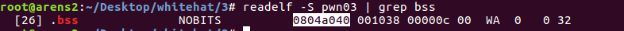
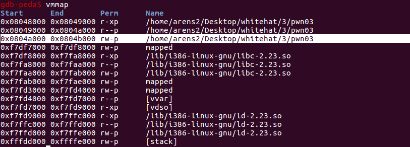
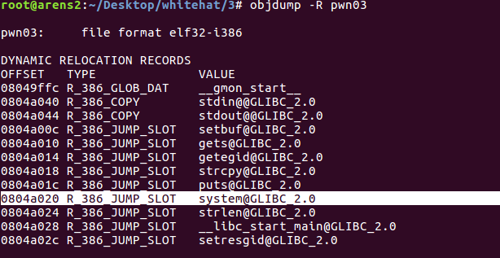

# Problem

```sh
Download file here:
https://drive.google.com/file/d/1I7-UC2D0rVhrJlnfVEDG8ZD7Bknq3Vgt/view?usp=sharing
Submit WhiteHat{sha1(flag)}
nc 103.237.99.35 25033
```

# Solution
- Bài này cũng là 1 bài về dạng **Buffer overflow**, bài này giống bài pwn01, nhưng có vẻ hay hơn, bài này 32bit nên dễ nhìn hơn nữa :). Nó không cho mình file libc thay vào đó nó lại load sẵn hàm `system` vào `GOT` cho mình luôn, đỡ mất công tính toán, có sẵn hàm puts, mà lại là 32bit nên chỉ cần quản lí stack thôi là có thể tìm được địa chỉ hàm `system()` rồi. MÌnh nói hay ở chỗ là ở bài trước trong file libc có sẵn chuỗi `/bin/sh` cho mình rồi, còn bài này thì không, mình phải tự tạo ra chuỗi `/bin/sh` bằng cách sử dụng hàm `gets`. Có `gets` có `puts` (song kiếm hợp bích, hehe) thì mình có thể ghi vào bất cứ đâu (vùng nhớ mà có write permission) giá trị mà mình muốn và in ra bất cứ chỗ nào (với điều kiện địa chỉ vùng nhớ hợp lệ) mà mình muốn.

- Tóm tắt qua bài này chút: bài này dùng `gets` để nhận chuỗi mình nhập, kiểm tra số lượng kí tự trong chuỗi của mình rồi lấy cái số đó làm tham số để đưa vào hàm `check_argv()`. Mà cái hàm này cũng chẳng có gì quan trọng lắm, tính toán sao đấy, để trả về 0 hoặc 1, nếu trả về 0 thì thoát chương trình, 1 thì in ra 1 chuỗi, copy chuỗi của mình vào 1 biến khác rồi thoát. 

- Tóm tắt hướng khai thác bài này:
   + Đầu tiên làm tràn bộ nhớ để khi thoát khỏi `main` nó thực thi hàm `gets`, tham số của hàm `gets` mình chọn 1 địa chỉ trên vùng nhớ `.bss` (lí do là vùng nhớ của địa chỉ này có quyền write, và vùng nhớ này lại cố định nữa, còn thèn `stack` thì khác, tuy nó cũng có quyền write nhưng mỗi lần chạy chương trình thì địa chỉ vùng nhớ `stack` lại thay đổi, cũng có thể dùng `puts` để tìm địa chỉ trên `stack` nhưng hơi mất công). Sau khi ghi ghi xong chuỗi `/bin/sh` vào vùng nhớ đó rồi thì lợi dụng `ret` của hàm `gets` để quay về hàm `main()`.
Mục đích overflow lần này là để có 1 cái địa chỉ mà có chứa chuỗi `/bin/sh`.




   + Sau khi có địa chỉ của chuỗi `/bin/sh` rồi thì tiếp đến chúng ta cần đia chỉ của hàm `system()`. Bằng cách sử dụng hàm `puts` để in địa chỉ hàm `system()` ra ngoài, sau đó lợi dụng `ret` của `puts` để tiếp tục quay về `main`.



   + Lúc này đã có địa chỉ `system` và địa chỉ của chuỗi `/bin/sh` thì có thể xem như đã xong. Code mình để trong file `exp.py`

Ps: Bài này thì mức độ ngang bài đầu tiên, tuy nhiên mình lại cay cú vụ đi tìm flag ở server T.T


